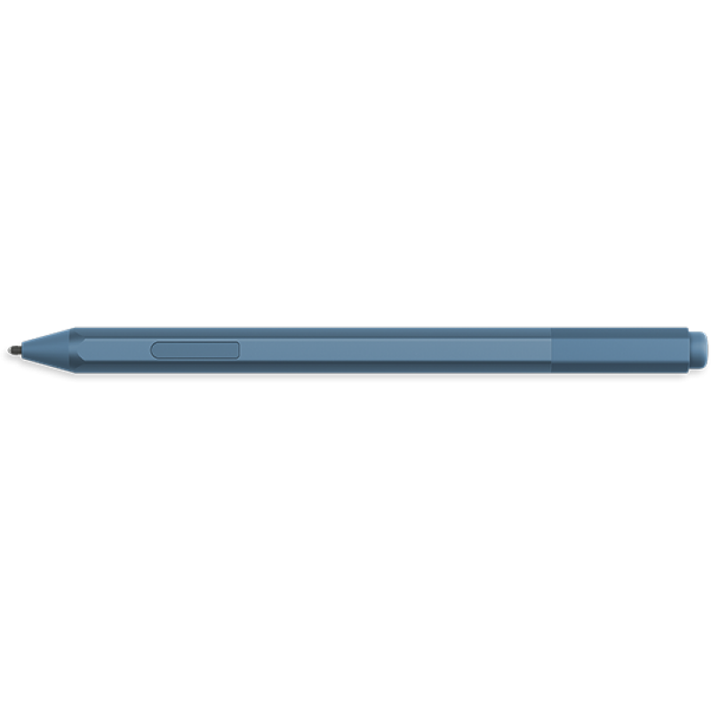
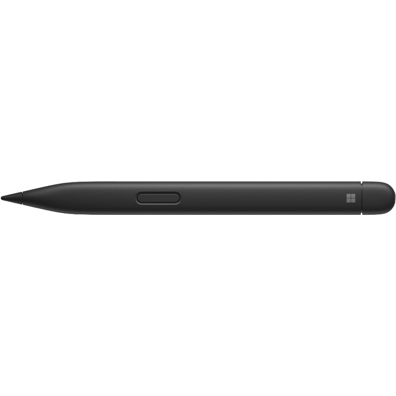

# Sexy S-Pen

<p align="center">
  
</p>

<h1 align="center">Sexy S-Pen</h1>

<p align="center"><strong>A beautiful, artist-first Surface Pen control centre for KDE Plasma, Wayland, and Surface Linux.</strong></p>

<p align="center">
  <a href="https://github.com/pfn000/sexy-s-pen/releases"></a>
  <a href="https://github.com/pfn000/sexy-s-pen"></a>
  <a href="https://github.com/pfn000/sexy-s-pen/blob/master/LICENSE"></a>
</p>

Sexy S-Pen brings together palm-rejection profiles, pressure and smoothing preferences, hover and tilt capability reporting, button mappings, Bluetooth pairing handoff, battery-state monitoring, Plasma calibration guidance, Flatpak packaging, an Arch `PKGBUILD`, a shell installer, and a friendly animated interface for Surface Linux.

> **Design principle:** every feature is progressively enhanced. Sexy S-Pen detects what the connected pen and Linux input stack actually expose instead of claiming that every Surface Pen has the same hardware.

## The pen gallery

| Surface Pen family | Visual reference | Intended Sexy S-Pen behavior |
|---|---|---|
| **Surface Pen — current user pen** |  | Pressure profiles, palm rejection, button mapping, and any runtime-reported Bluetooth, battery, tilt, or hover features |
| **Surface Slim Pen / Slim Pen 2** |  | Full progressive-enhancement path: pairing, battery attempt, pressure, tilt, hover, buttons, and artist profiles |

## Microsoft Surface Pen family support

Microsoft’s official compatibility guide groups Surface Pens by feature family and makes clear that pressure resolution, tilt, Bluetooth, and magnetic attachment vary by model [1]. Sexy S-Pen therefore supports the broad family through capability detection rather than hard-coding a single pen model.

| Pen family | Pressure / inking | Bluetooth | Tilt | Buttons / eraser | Sexy S-Pen behavior |
|---|---:|---:|---:|---:|---|
| Surface Slim Pen / Slim Pen 2 | 4096 points | Yes | Yes | Device-dependent | Full artist profile; pairing, battery, tilt, hover, and buttons when Linux exposes them |
| Surface Slim Pen, 1st generation | 4096 points | Yes | Yes | Device-dependent | Same progressive-enhancement path as Slim Pen 2 |
| Surface Pen with no clip | 1024 or 4096 depending on model | Yes | Model-dependent | Yes, depending on model | Pressure, buttons, pairing, battery, tilt, and hover only when detected |
| Surface Pen with one button on flat edge | 1024 or 4096 depending on model | Yes | Model-dependent | Single side action | Single-button mapping plus pressure and palm-rejection profiles |
| Surface Pen with two side buttons | 1024 or 4096 depending on model | Yes | Model-dependent | Two side actions | Separate side-button mappings and eraser/tool events when exposed |
| Microsoft Classroom Pen | 1024 or 4096 depending on model | No | No | Model-dependent | Writing and pressure controls; Bluetooth UI hidden when unavailable |
| Microsoft Classroom Pen 2 / Microsoft Business Pen | 1024 or 4096 depending on model | No | No | Model-dependent | Same non-Bluetooth progressive-enhancement path |
| Surface Pro Pen | 1024 points | No | No | Model-dependent | Pressure and inking; no invented pairing, battery, tilt, or hover controls |
| Surface Hub Pen | 4096 points | Yes | Yes | Dual-pen support on supported systems | Pressure, tilt, Bluetooth/battery attempt, and dual-tool capability where Linux exposes it |

### What is detected at runtime

Sexy S-Pen probes for IPTSD availability, pressure, tilt axes, proximity/hover, tip and eraser state, tool buttons, Bluetooth connection, and BlueZ battery data. A Bluetooth pen may still report no battery percentage, and a pen advertised with tilt support may not expose tilt through a particular Linux kernel or compositor path. Those cases are shown as **Unavailable** rather than simulated.

## Artist-first features

| Feature | Purpose |
|---|---|
| **Writing mode** | Strong palm rejection and a forgiving pressure curve for notes and handwriting |
| **Drawing mode** | Faster response, lighter smoothing, and expressive pressure behavior |
| **Touch-first mode** | Restores touch interaction when the pen is not being used for writing |
| **Pressure feel** | Tip threshold, soft/linear/firm curve, and smoothing controls |
| **Hover and tilt status** | Capability chips and future live meters for proximity and tilt axes |
| **Button profiles** | Undo, eraser, redo, middle/right click concepts, and custom shortcut-ready actions |
| **Pairing bubble** | Animated connection transition that opens KDE Bluetooth settings safely |
| **Battery bubble** | Live percentage when BlueZ reports it, with explicit unknown and disconnected states |
| **Calibration guidance** | Launch/status path for Plasma’s four-point tablet calibration and parallax correction |

## Install on CachyOS or Arch Linux

Install dependencies and build from the public repository:

```bash
sudo pacman -S --needed base-devel cmake ninja qt6-base qt6-declarative
git clone https://github.com/pfn000/sexy-s-pen.git
cd sexy-s-pen
./scripts/install-sexy-s-pen.sh build
```

The installer builds from checked-out source and requests `sudo` only for the final installation. It does not execute an unverified remote script as root.

The requested command `sudo pacman -S sexy-s-pen` becomes valid after the package is published to an official repository, trusted custom repository, or AUR. For the current Arch-native path:

```bash
cd packaging
makepkg -si
```

AUR packages are user-produced PKGBUILDs and should be inspected before building [2].

## Flatpak

The repository includes `packaging/io.github.sexyspen.SexySPen.yml`. Flatpak isolates applications and requires explicit permissions for resources such as Wayland, graphics, and Bluetooth D-Bus access [3]. Build locally with:

```bash
sudo pacman -S --needed flatpak flatpak-builder
git clone https://github.com/pfn000/sexy-s-pen.git
cd sexy-s-pen
./scripts/install-sexy-s-pen.sh flatpak
```

A future Flathub submission should keep permissions narrow and use a carefully scoped host integration mechanism if applying IPTSD system configuration becomes necessary. The GUI must not receive unrestricted host filesystem access merely to edit `/etc/iptsd.conf`.

## Releases and updates

The release channel is hosted at [github.com/pfn000/sexy-s-pen/releases](https://github.com/pfn000/sexy-s-pen/releases). GitHub’s public Releases API exposes release tags, assets, download URLs, and asset digests [4]. The intended update flow is to use a verified release asset, `flatpak update`, or `pacman -Syu`; Sexy S-Pen should never silently replace its own executable.

## Community

If Sexy S-Pen makes your workflow nicer, visit the [public GitHub repository](https://github.com/pfn000/sexy-s-pen), share it, open issues, and contribute improvements. The application also includes a Liberapay button pointing to `https://liberapay.com/pfn000/`; replace that URL if the project adopts another Liberapay account.

### Fork with respect

Forks and experiments are welcome. Please keep the original project link, GPL license, image attributions, and meaningful credit to **pfn000** intact. If you publish a substantially renamed or redistributed derivative, please contact the maintainer first so we can coordinate improvements, avoid confusion, and make sure the original project receives clear credit. GitHub forks and the GPL-3.0-or-later license remain governed by their normal permissions; this is a community request for respectful collaboration, not an attempt to override those rights. See [`CONTRIBUTING.md`](CONTRIBUTING.md) for the full guidance.

## Development

```bash
cmake -S . -B build -G Ninja -DCMAKE_BUILD_TYPE=Release
cmake --build build
./build/sexy-s-pen
```

The repository contains Qt 6/QML source, a C++ controller, packaging files, feature documentation, and the supplied pen reference images. The final binaries should be built on CachyOS, Arch Linux, or CI with the Qt development packages installed.

## Image attribution

The two README product images were supplied by the project owner and are preserved with their original source URLs in [`docs/assets/README-image-sources.md`](docs/assets/README-image-sources.md). Before a formal Flathub submission or other redistribution, verify that the image licenses permit repository redistribution; replace them with project-created or permissively licensed assets if necessary.

## References

[1]: https://support.microsoft.com/en-us/surface/pen/surface-pen-compatibility-and-features "Microsoft Surface Pen compatibility and features"
[2]: https://wiki.archlinux.org/title/Arch_User_Repository "ArchWiki — Arch User Repository"
[3]: https://docs.flatpak.org/en/latest/flatpak-command-reference.html "Flatpak command reference"
[4]: https://docs.github.com/en/rest/releases/releases "GitHub Releases REST API"
